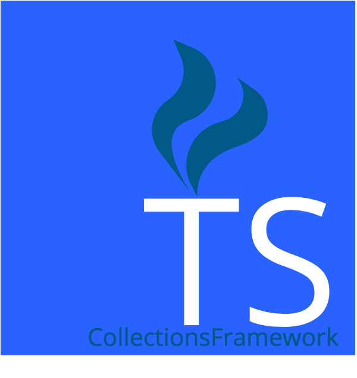

**"If you know the Java Collections Framework, you know the Typescript Collections Framework.   It's the same API (mostly)"**

It is designed for and written by Java coders who also needed to do TypeScript programming.

[](https://npmjs.org/typescriptcollectionsframework)
[](https://travis-ci.org/larrydiamond/typescriptcollectionsframework)
[](https://david-dm.org/larrydiamond/typescriptcollectionsframework?type=dev)
[](
https://codecov.io/gh/larrydiamond/typescriptcollectionsframework)
[](https://nodesecurity.io/orgs/ldiamond/projects/42e5c9e8-7ade-41c4-b367-9e6aef26804f)
[](http://www.emergencykitten.com/)
[](https://greenkeeper.io/)

**TypeScript Collections Framework** is a port of the Java Collections framework to TypeScript.   

# Demo & Tutorial project with Angular 5
Demo: https://larrydiamond.github.io/typescriptcollectionsframework-Demo-For-Angular5/dist/

Source: https://github.com/larrydiamond/typescriptcollectionsframework-Demo-For-Angular5

# Demo & Tutorial project with Angular 4
Demo: https://larrydiamond.github.io/typescriptcollectionsframework-Demo-For-Angular4/dist/

Source: https://github.com/larrydiamond/typescriptcollectionsframework-Demo-For-Angular4

# Demo & Tutorial project with Angular 2
Demo: https://larrydiamond.github.io/typescriptcollectionsframework-Demo-For-Angular2/dist/

Source: https://github.com/larrydiamond/typescriptcollectionsframework-Demo-For-Angular2

# Classes documentation
https://larrydiamond.github.io/typescriptcollectionsframework/typedoc/

[ArrayList](https://larrydiamond.github.io/typescriptcollectionsframework/typedoc/classes/_arraylist_.arraylist.html), [LinkedList](https://larrydiamond.github.io/typescriptcollectionsframework/typedoc/classes/_linkedlist_.linkedlist.html), [SkipListSet](https://larrydiamond.github.io/typescriptcollectionsframework/typedoc/classes/_skiplist_.skiplistset.html), [TreeSet](https://larrydiamond.github.io/typescriptcollectionsframework/typedoc/classes/_treeset_.treeset.html),
[PriorityQueue](https://larrydiamond.github.io/typescriptcollectionsframework/typedoc/classes/_priorityqueue_.priorityqueue.html),
[HashSet](https://larrydiamond.github.io/typescriptcollectionsframework/typedoc/classes/_hashset_.hashset.html),
[HashMap](https://larrydiamond.github.io/typescriptcollectionsframework/typedoc/classes/_hashmap_.hashmap.html), [SkipListMap](https://larrydiamond.github.io/typescriptcollectionsframework/typedoc/classes/_skiplist_.skiplistmap.html),  [TreeMap](https://larrydiamond.github.io/typescriptcollectionsframework/typedoc/classes/_treemap_.treemap.html) are all live and available today.

[Collection](https://larrydiamond.github.io/typescriptcollectionsframework/typedoc/interfaces/_collection_.collection.html),
[List](https://larrydiamond.github.io/typescriptcollectionsframework/typedoc/interfaces/_list_.list.html), [JSet](https://larrydiamond.github.io/typescriptcollectionsframework/typedoc/interfaces/_jset_.jset.html), [JMap](https://larrydiamond.github.io/typescriptcollectionsframework/typedoc/interfaces/_jmap_.jmap.html),
[Queue](https://larrydiamond.github.io/typescriptcollectionsframework/typedoc/interfaces/_queue_.queue.html), and [Deque](https://larrydiamond.github.io/typescriptcollectionsframework/typedoc/interfaces/_deque_.deque.html) interfaces are also available with many others to come soon (or are already here and aren't yet documented :) )

Version 4 goals include ease of use, and a tutorial with code examples in Java and TypeScript

# My goals of this project
* Port over as many of the classes and interfaces I've previously used as a Java developer to TypeScript
* Support putting "stuff" from other libraries into Collections without having to box and unbox objects.
* Use the compiler as much as possible to catch issues at compile rather than at run time or at test time.
* Eventually incorporate some of the classes from Apache Commons Collections and Google Guava.   

# Class Hierarchy


# Installation instructions

Install `typescriptcollectionsframework` from `npm`
```bash
npm install typescriptcollectionsframework --save
```

# How to build for development
 - clone repository
 - `npm install`
 - `npm test`

# Design methodology
The goal of this library is to provide a "as Java Collections" framework as possible so that developers can migrate their existing Java knowledge to TypeScript and be productive quicker.   It won't be possible to perfectly recreate the framework since the language is not the same, but the goal is to provide as many of the "normal" classes as possible with as many of the "normal" methods as possible.

Semver was adopted as of version 1.0 of this framework.

In TypeScript all objects do not inherit from Object (which we do not control anyway), so we made added a parameter to the constructors of each class to compare objects and calculate hash codes.   As a result, anything can be put into the Collections, even string, number, and classes from other packages.   There is no String class to wrap string, no Number class to wrap number, and no Boolean class to wrap boolean.   No autoboxing and no autounboxing.

# Immutability
I am a big proponent of Immutability.   Google Guava explains this very well [Google Guava Immutable Collections Explained](https://github.com/google/guava/wiki/ImmutableCollectionsExplained).   Our implementations differ significantly.   Collection subclasses ImmutableCollection.   Every object created from this framework has an Immutable interface that is safe to pass around confident that the object cannot be changed via the methods exposed by the Immutable interface.   All Sets inherit from ImmutableSet and have an immutableSet method that returns an ImmutableSet.    All Maps inherit from ImmutableMap and have an immutableMap method that returns an ImmutableMap.   All Lists inherit from ImmutableList and have an immutableList method that returns an ImmutableList.   These interfaces provide immutable versions of the real Collection or Map that you can pass to methods confident that your Collection or Map will not be modified by that method.   You can also write a method that takes an Immutable object and let your callers know that you promise not to modify the object you receive.

# Thank you for all the support.   
The number of NPM downloads has been way higher than I expected.  150 in the first three days, 350 in the first five days, 600 in the first week. That's *way* *way* *way* more interest in what I'm doing than I expected.   Thank you!  The volume has been steadily increasing since then every month.   

Please feel free to email me at ldiamond at ldiamond dot com with feature requests.  I love to hear from people putting my effort to good use.   :)

# Author
Larry Diamond https://www.linkedin.com/in/larry-diamond-3964042/   ldiamond at ldiamond dot com    Please feel free to contact me for training or with questions

**Please** volunteer to contribute.   All contributors will be listed here and I will of course help you to become recognized as a TypeScript expert so it helps your career  :)

# Contributors

Frank Giordano (https://github.com/frankgiordano)

Stephen E. Chiang (https://github.com/chiangs)
